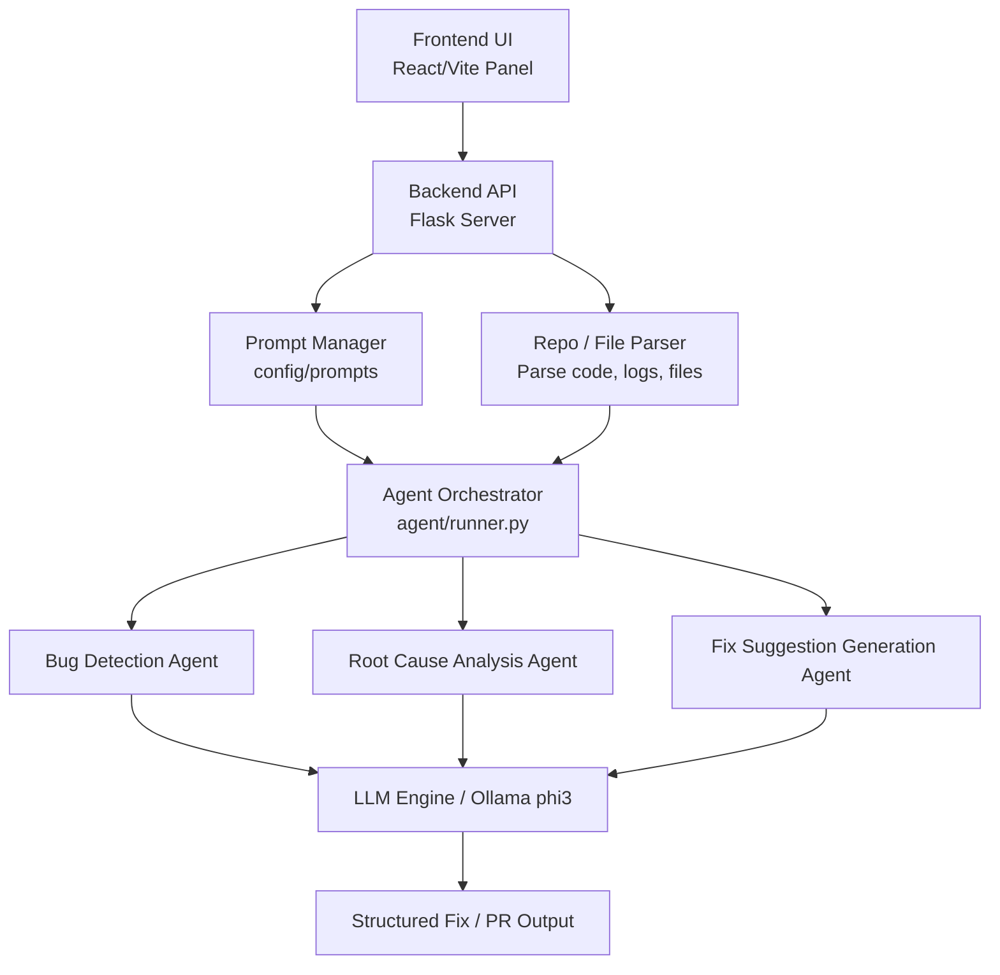

# AgentSmiths 🤖

The Next-Generation Autonomous AI Debugger. AgentSmiths identifies, diagnoses, and repairs logical flaws and bugs in your codebase before they hit production.

## 🚀 About the Project
AgentSmiths is an AI-powered developer tool designed to autonomously detect bugs, trace execution, and generate fixes via an interactive, agentic workflow. It features:
- **Repository-Wide Analysis:** Scans entire projects to flag hidden logical errors.
- **Real-Time Fix Generation:** Uses local LLMs (powered by Ollama) to propose structural and syntactical fixes.
- **One-Click Pull Requests:** Seamlessly integrates with GitHub to push fixed code directly to a new branch.
- **Interactive UI:** Provides a premium, dark-themed dashboard to monitor the agent's "thinking" process, view execution traces, and manage code diffs.
- **Modular Architecture:** Cleanly separated concerns (Routes, Agents, Services, config) for infinite scalability.

## ⚙️ Tech Stack
- **Frontend:** React, Vite, TailwindCSS, Monaco Editor, Lucide-React
- **Backend:** Python, Flask, Git integration
- **AI Engine:** Ollama (Local LLM - specifically optimized for `phi3`)

---

## 🏛️ Architecture


---

## 🛠️ How to Run Locally

### Prerequisites
1. **Node.js** (v16+)
2. **Python** (3.8+)
3. **Ollama**: Installed and running locally. You must pull the `phi3` model:
   ```bash
   ollama run phi3
   ```
4. **Git**: Installed for repository cloning functionality.

### 1. Start the Backend (Flask)
Open a terminal and run the following:
```bash
cd backend

# Create and activate a virtual environment (Optional but recommended)
python -m venv venv
# Windows: venv\Scripts\activate
# Mac/Linux: source venv/bin/activate

# Install dependencies
pip install -r requirements.txt

# Start the Flask server
python app.py
```
The backend will run on `http://127.0.0.1:5000`.

### 2. Start the Frontend (React/Vite)
Open a new terminal and run:
```bash
cd frontend

# Install Node modules
npm install

# Start the development server
npm run dev
```
The frontend will run on `http://localhost:5173`. Open this in your browser to access the AgentSmiths dashboard.

---

## 🧪 Testing Guide

AgentSmiths supports a multi-layered testing approach to ensure stability and accuracy across both the UI and the underlying AI pipeline.

### 1. Unit Testing
Ensure the core logic, state management, and AI extraction tools function flawlessly in isolation.
- **Backend Services:** The `services/llm_service.py` contains isolated parsing logic (`extract_code_from_ai`). You can write `pytest` scripts to assert that invalid AI outputs, markdown wrappers, and empty strings are safely handled and fallbacks trigger.
- **Agent Loop:** Test `agent/runner.py` by mocking the state and ensuring the Planner and DecisionMaker transition correctly.
- **Frontend Components:** React components can be tested using Jest to ensure correct state updates when an AI fix is accepted or rejected.

### 2. Manual Testing
Actively simulate developer workflows.
- **Sandbox Mode:** Use the embedded Monaco Editor to manually write Python snippets with deliberate logical or syntax errors (e.g., writing `return a - b` instead of `return a + b`). Click "Run Agent" to manually verify the execution trace and the AI's proposed solution.
- **GitHub Integration:** Authorize with your GitHub account, load a repository, and manually trigger an analysis to verify if the parsed file tree populates correctly and issues are highlighted in the UI.

### 3. API Testing
Test the core integration points between the frontend and the Flask server.
- Use **Postman** or **cURL** to hit the Flask endpoints.
- **Analyze Endpoint:** Send a `POST` to `http://127.0.0.1:5000/analyze` with a JSON payload `{"code": "def test(): pass"}` to verify the LLM service connects and returns a structured JSON response.
- **Prompts Configuration:** Send a `GET` request to `http://127.0.0.1:5000/prompts` to verify the `config/prompts.json` config routes are fully accessible.

### 4. UI / UX Testing
Validate the visual hierarchy and responsiveness.
- **Responsive Design:** Resize the browser window to ensure the glassmorphic dashboard, split-pane editors, and floating action panels scale correctly on smaller monitors.
- **Animation & Transitions:** Verify that the "Agent Thinking" pipeline, progress bars, and scroll-triggered animations (like the Feedback section) trigger smoothly without blocking the main thread.
- **Error States:** Purposely shut down the Ollama server and trigger an analysis to ensure the UI gracefully displays a "Connection Error" fallback notification instead of crashing the app.

### 5. Prototype Preview
### Landing Page

### Debugging Workspace

### Feedback / Contact Panel


---

## 📄 License
&copy; 2026 AgentSmiths. All rights reserved.
